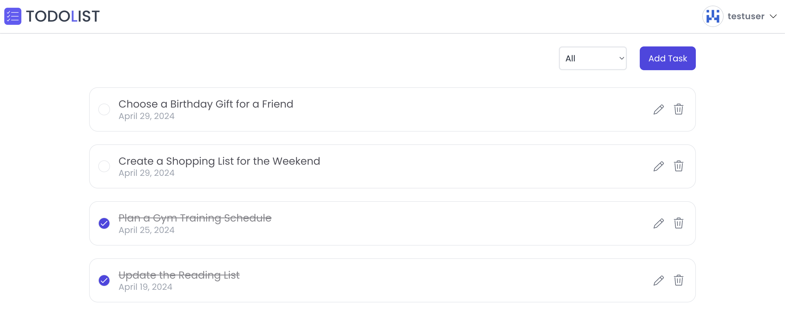

# MERN TODO APP

This project is a TODO application using the MERN stack (MongoDB, Express.js, React, Node.js).

## Demo

This application is deployed in Vercel. [here](https://mern-todolist-kappa.vercel.app/).

## Features

- Add, update, and delete tasks
- Manage task states (completed, incomplete)
- Responsive design

## Tech Stack

- Frontend: React + Vite
- Styling: SCSS
- Backend: Express.js, MongoDB
- State Management: Redux Toolkit

## Setup Instructions

### Prerequisites

- Node.js
- MongoDB

### Installation

1. Clone the repository.
   ```
   git clone https://github.com/a-onode/mern-todo-app
   ```
2. Install dependencies for both client and server.
   ```
   cd client && npm install
   cd ../server && npm install
   ```
3. Create a `.env` file in the server directory and set up the necessary environment variables. Example:
   ```
   PORT=3000
   MONGO_URI=your_mongodb_uri_here
   JWT_SECRET=your_jwt_secret_here
   ```
4. Start the server.
   ```
   npm run dev
   ```
5. In a new terminal, start the client.
   ```
   cd client && npm run dev
   ```

## License

This project is open-sourced under the MIT License.
